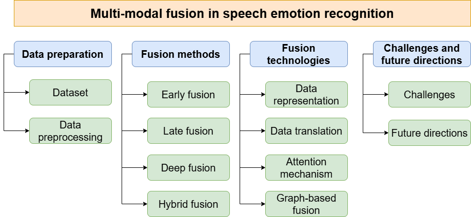

# **Awesome Multi-modal Fusion in Speech Emotion Recognition**

<i> Welcome to the **Awesome Multi-modal Fusion in Speech Emotion Recognition** GitHub repository, the official companion to our survey paper: **"Multi-Modal Fusion in Speech Emotion Recognition: A Comprehensive Review of Methods and Technologies."** </i>

---

<p align='center'>


</p>

<p align='center'>


</p>

<p align='center'>


</p>

## Citation
```python
# Update soon
```
## Update
- **First release:** December 4th, 2024. 

# Table of Contents

- [**Introduction**](#introduction)
- [**Related Survey**](#related-survey)
- [**Datasets**](#datasets)
- [**Review of Fusion Methods in SER**](#review-of-fusion-methods-in-ser)
    - [**Early Fusion**](#early-fusion)
    - [**Late Fusion**](#late-fusion)
    - [**Deep Fusion**](#deep-fusion)
    - [**Hybrid Fusion**](#hybrid-fusion)
- [**Review of Fusion Technologies in SER**](#review-of-fusion-technologies-in-ser)
    - [**Data Representation**](#data-representation)
        - [**Joint Representation**](#joint-representation)
        - [**Coordinated Representaion**](#coordinated-representation)
    - [**Data Translation**](#data-translation)
    - [**Attention Mechanism**](#attention-mechanism)
        - [**Multi-Head Attention**](#multi-head-attention)
        - [**Cross-Modality Attention**](#cross-modality-attention)
        - [**Dual-Attention Network**](#dual-attention-network)
        - [**Graph Attention Network**](#graph-attention-network)
    - [**Graph-Based Fusion**](#graph-based-fusion)

# Introduction
Emotions play a pivotal role in human communication, expressed through speech, gestures, and physiological cues, making **Speech Emotion Recognition (SER)** a key area in human-computer interaction research. While uni-modal SER focuses on analyzing specific speech features like prosody and intonation, it faces challenges such as noise susceptibility and limited accuracy in dynamic environments. **Multi-modal fusion**, integrating acoustic, visual, and textual features, overcomes these limitations, offering a comprehensive representation of emotional states but introducing complexities like synchronization and computational demands. This survey reviews and compares various *fusion methods*—early, late, deep, and hybrid—and cutting-edge models, and *fusion technologies* including data representation, data translation, attention mechanisms and graph-based approaches, assessing their performance across datasets. It identifies challenges, such as data alignment and modality-specific noise, and proposes future research directions to enhance SER systems' efficacy, providing a structured roadmap for advancing multi-modal fusion in SER.



**Figure 1:** Overview of multi-modal fusion in SER.


# Related Survey
**A snapshot research and implementation of multimodal information fusion for data-driven emotion recognition.**\
*Jiang, Y., Li, W., Hossain, M. S., Chen, M., Alelaiwi, A., & Al-Hammadi, M.*\
[*2020*] [Information Fusion]\
[[Paper](https://doi.org/10.1016/j.inffus.2019.06.019)]

**Survey on bimodal speech emotion recognition from acoustic and linguistic information fusion.**\
*Atmaja, Bagus Tris, Akira Sasou, and Masato Akagi.*\
[*2022*] [Speech Communication]\
[[Paper](https://doi.org/10.1016/j.specom.2022.03.002)]

**A review of multimodal emotion recognition from datasets, preprocessing, features, and fusion methods.**\
*Pan, B., Hirota, K., Jia, Z., & Dai, Y.*\
[*2023*] [Neurocomputing]\
[[Paper](https://doi.org/10.1016/j.neucom.2023.126866)]

**Deep Learning Approaches for Bimodal Speech Emotion Recognition: Advancements, Challenges, and a Multi-Learning Model**\
*S. Kakuba, A. Poulose and D. S. Han*\
[*2023*] [IEEE Acess]\
[[Paper](https://doi.org/10.1109/ACCESS.2023.3325037)]

**A comprehensive survey on deep learning multi-modal fusion: Methods, technologies and applications.**\
*T. Jiao, C. Guo, X. Feng, Y. Chen, and J. Song*\
[*2024*] [Computers, Materials & Continua]\
[[Paper](https://doi.org/10.32604/cmc.2024.053204)]

**Multi-modal fusion approaches for tourism: A comprehensive survey of data-sets, fusion techniques, recent architectures, and future directions.**\
*Q. W. Khan, R. Ahmad, A. Rizwan, A. N. Khan, C.-W. Park, and D. Kim*\
[*2024*] [Computers and Electrical Engineering]\
[[Paper](https://doi.org/10.1016/j.compeleceng.2024.109220)]

# Data sets
**Cmu-moseas: A multimodal language dataset for Spanish, Portuguese, German and French**\
*A. Zadeh, Y. S. Cao, S. Hessner, P. P. Liang, S. Poria, and L.-P. Morency*\
[*2020*] [Proceedings of the Conference on Empirical Methods in Natural Language Processing. Conference on Empirical Methods in Natural Language Processing]\
[[Paper](https://doi.org/10.18653/v1/2020.emnlp-main.141)]

**A database of german emotional speech.**\
*F. Burkhardt, A. Paeschke, M. Rolfes, W. F. Sendlmeier, B. Weiss et al.*\
[*2005*] [Interspeech]\
[[Paper](https://doi.org/10.21437/Interspeech.2005-446)]

**EMOVO corpus: an Italian emotional speech database**\
*G. Costantini, I. Iaderola, A. Paoloni, and M. Todisco*\
[*2016*] [Proceedings of the Ninth International Conference on Language Resources and Evaluation]\
[[Paper](http://www.lrec-conf.org/proceedings/lrec2014/pdf/591)]

**Iemocap: Interactive emotional dyadic motion capture database,” Language resources and evaluation**\
*C. Busso, M. Bulut, C.-C. Lee, A. Kazemzadeh, E. Mower, S. Kim, J. N. Chang, S. Lee, and S. S. Narayanan*\
[*2008*]\
[[Paper](https://doi.org/10.1007/s10579-008-9076-6)]

**The model for end-stage liver disease (meld)**\
*P. S. Kamath and W. R. Kim*\
[*2007*] [Hepatology]\
[[Paper](https://doi.org/10.1002/hep.21563)]

**The ryerson audio-visual database of emotional speech and song (ravdess): A dynamic, multimodal set of facial and vocal expressions in north american english**\
*S. R. Livingstone and F. A. Russo*\
[*2018*] [PloS one]\
[[Paper](https://doi.org/10.1371/journal.pone.0196391)]

**Recognizing human emotional state from audiovisual signals**\
*Y. Wang and L. Guan*\
[*2008*] [IEEE transactions on multimedia]\
[[Paper](https://doi.org/10.1109/TMM.2008.927665)]

**Surrey audio-visual expressed emotion (savee) database**
*P. Jackson and S. Haq*\
[*2014*] [University of Surrey: Guildford]\
[[Website](http://kahlan.eps.surrey.ac.uk/savee/)]


# Review of fusion methods in SER
## Early fusion

**Late fusion multiview clustering via min-max optimization**\
*M. Li, X. Liu, Y. Zhang, and W. Liang*\
[*2023*] [IEEE Transactions on Neural Networks and Learning Systems]

**Speech emotion recognition via graph-based representations**\
*Pentari, A., Kafentzis, G., Tsiknakis, M.*\
[*2024*] [Scientific Reports]\
[[Paper](https://doi.org/10.1038/s41598-024-52989-2)]

**An efficient feature selection method for arabic and english speech emotion recognition using grey wolf optimizer**\
*Shahin, I., Alomari, O.A., Nassif, A.B., Afyouni, I., Hashem, I.A., Elnagar, A.*\
[*2023*] [Applied Acoustics]

**Fusion-based speech emotion classification using two-stage feature selection.**\
*Xie, J., Zhu, M., Hu, K.*\
[*2023*] [Speech Communication]\
[[Paper](https://doi.org/10.1016/j.specom.2023.102955)]

**Attention guided 3d cnn-lstm model for accurate speech based emotion recognition.**\
*Atila, O., Şengür, A.*\
[*2021*] [Applied Acoustics]\
[[Paper](https://doi.org/10.1016/j.apacoust.2021.108260)]

## Late fusion
**A multi-feature fusion speech emotion recognition method based on frequency band division and improved residual network.**\
*Guo, Y., Zhou, Y., Xiong, X., Jiang, X., Tian, H., Zhang, Q.*\
[*2023*] [IEEE Access]\
[[Paper](https://doi.org/10.1109/ACCESS.2023.32998220)]

**Cross corpus speech emotion recognition using transfer learning and attention-based fusion of wav2vec2 and prosody features.**\
*Naderi, N., Nasersharif, B.*\
[*2023*] [Knowledge-Based Systems]\
[[Paper](https://doi.org/10.1016/j.knosys.2023.110814)]

**A parallel-model speech emotion recognition network based on feature clustering.**\
*Zhang, L.M., Ng, G.W., Leau, Y.B., Yan, H.*\
[*2023*] [IEEE Access]\
[[Paper](https://doi.org/10.1109/ACCESS.2023.3294274)]

**Multiple models fusion for multi-label classification in speech emotion recognition systems**\
*Slimi, Anwer and Hafar, Nafaa and Zrigui, Mounir and Nicolas, Henri*\
[*2022*] [Procedia Computer Science]\
[[Paper](https://doi.org/10.1016/j.procs.2022.09.345)]

**Graph based emotion recognition with attention pooling for variable-length utterances.**\
*Liu, J., Wang, H., Sun, M., Wei, Y.*\
[*2022*] [Neurocomputing]\
[[Paper](https://doi.org/10.1016/j.neucom.2022.05.007)]

**Research on feature fusion speech emotion recognition technology for smart teaching**\
*Zhang, Shaoyun and Li, Chao*\
[2022] [Mobile Information Systems]\
[[Paper](https://doi.org/10.1155/2022/7785929)]

**Multi-type features separating fusion learning for Speech Emotion Recognition**\
*Xu, Xinlei and Li, Dongdong and Zhou, Yijun and Wang, Zhe*\
[*2022*] [Applied Soft Computing]\
[[Paper](https://doi.org/10.1016/j.asoc.2022.109648)]

**Robinnet: A multimodal speech emotion recognition system with speaker recognition for social interactions.**\
*Khurana, Y., Gupta, S., Sathyaraj, R., Raja, S.P.*\
[*2024*] [IEEE Transactions on Computational Social Systems]\
[[Paper](https://doi.org/10.1109/TCSS.2022.3228649)]

**Speech emotion recognition by late fusion for bidirectional reservoir computing with random projection.**\
*Ibrahim, H., Loo, C.K., Alnajjar, F.*\
[*2021*] [IEEE Access]\
[[Paper](https://doi.org/10.1109/ACCESS.2021.3107858)]

**A novel dual attention-based blstm with hybrid features in speech emotion recognition.**\
*Chen, Q., Huang, G.*\
[*2021*] [Engineering Applications of Artificial Intelligence]\
[[Paper](https://doi.org/10.1016/j.engappai.2021.104277)]

**Att-net: Enhanced emotion recognition system using lightweight self-attention module.**\
*Kwon, S., et al.*\
[*2021*] [Applied Soft Computing]\
[[Paper](https://doi.org/10.1016/j.asoc.2021.107101)]

**Speech emotion recognition using fusion of three multi-task learning-based classifiers: HSF-DNN, MS-CNN and LLD-RNN**\
*Yao, Zengwei and Wang, Zihao and Liu, Weihuang and Liu, Yaqian and Pan, Jiahui*\
[*2020*] [Speech Communication]\
[[Paper](https://doi.org/10.1016/j.specom.2020.03.005)]
## Deep fusion

**A multi-feature fusion speech emotion recognition method based on frequency band division and improved residual network.**\
*Guo, Y., Zhou, Y., Xiong, X., Jiang, X., Tian, H., Zhang, Q.*\
[*2023*] [IEEE Access]\
[[Paper](https://doi.org/110.1109/ACCESS.2023.3299822)]

**Speech emotion recognition based on multi-dimensional feature extraction and multi-scale feature fusion**\
*Yu, Lingli and Xu, Fengjun and Qu, Yundong and Zhou, Kaijun*\
[*2024*] [Applied Acoustics]\
[[Paper](https://doi.org/10.1016/j.apacoust.2023.109752)]

**A multi-message passing framework based on heterogeneous graphs in conversational emotion recognition.**\
*Meng, T., Shou, Y., Ai, W., Du, J., Liu, H., Li, K.*\
[*2024*] [Neurocomputing]\
[[Paper](https://doi.org/10.1016/j.neucom.2023.127109)]

**MM DialogueGAT—A Fusion Graph Attention Network for Emotion Recognition Using Multi-Model System**\
*Fu, Rui and Gai, Xiaomei and Abdulhakim Al-Absi, Ahmed and Abdulhakim Al-Absi, Mohammed and Alam, Muhammad and Li, Ye and Jiang, Meng and Wang, Xuewei*\
[*2024*] [IEEE Access]\
[[Paper](https://doi.org/110.1109/ACCESS.2024.3350156)]

**Speech Emotion Recognition Based on Feature Fusion and Residual Graph Convolutional Network**\
*Zhang, Yuanbang and Cui, Lin and Sun, Xiaodong and Xue, Kai*\
[*2023*] [IEEE International Conference on Signal Processing, Communications and Computing (ICSPCC)]\
[[Paper](https://doi.org/10.1109/ICSPCC59353.2023.10400357)]

**Dual memory fusion for multimodal speech emotion recognition**\
*Priyasad, D., Fernando, T., Sridharan, S., Denman, S., Fookes*\
[*2023*] [INTERSPEECH]\
[[Paper](https://doi.org/10.21437/Interspeech.2023-1090)]

**RBA-GCN: Relational Bilevel Aggregation Graph Convolutional Network for Emotion Recognition**\
*Yuan, Lin and Huang, Guoheng and Li, Fenghuan and Yuan, Xiaochen and Pun, Chi-Man and Zhong, Guo*\
[*2023*] [IEEE/ACM Transactions on Audio, Speech, and Language Processing]\
[[Paper](https://doi.org/10.1109/TASLP.2023.3284509)]

**Spatio-temporal representation learning enhanced speech emotion recognition with multi-head attention mechanisms.**\
*Chen, Z., Lin, M., Wang, Z., Zheng, Q., Liu, C.*\
[*2023*] [Knowledge-Based Systems]\
[[Paper](https://doi.org/10.1016/j.knosys.2023.111077)]

**Speech emotion recognition using multi-modal feature fusion network.**\
*Li, F., Luo, J., Liu, W.*
[*2023*] [2023 IEEE 6th International Conference on Pattern Recognition and Artificial Intelligence (PRAI)]\
[[Paper](https://doi.org/10.1109/PRAI59366.2023.10332053)]

**Improved speech emotion recognition focusing on high-level data representations and swift feature extraction calculation.**\
*Abdusalomov, A., Kutlimuratov, A., Nasimov, R., Whangbo, T.K.*\
[*2023*] [Computers, Materials & Continua]\
[[Paper](https://doi.org/10.32604/cmc.2023.044466.)]

**Self-labeling with feature transfer for speech emotion recognition**\
*Wen, Guihua and Liao, Huiqiang and Li, Huihui and Wen, Pengchen and Zhang, Tong and Gao, Sande and Wang, Bao*\
[*2022*] [Knowledge-Based Systems]\
[[Paper](https://doi.org/10.1016/j.knosys.2022.109589)]

**Head Fusion: Improving the Accuracy and Robustness of Speech Emotion Recognition on the IEMOCAP and RAVDESS Dataset**\
*Xu, Mingke and Zhang, Fan and Zhang, Wei*\
[*2021*] [IEEE Access]\
[[Paper](https://doi.org/10.1109/ACCESS.2021.3067460)]

## Hybrid fusion
**Speech emotion recognition based on multi coattention acoustic feature fusion.**\
*Song, H., Kang, K., Wei, Y., Zhang, H., Zhang, L.*\
[*2024*] [Second International Conference on Data Science and Information System (ICDSIS)]\
[[Paper](https://doi.org/10.1109/ICDSIS61070.2024.10594517)]

**Speech emotion recognition based on temporal-spatial learnable graph convolutional neural network.**\
*Yan, J., Li, H., Xu, F., Zhou, X., Liu, Y., Yang, Y.*
[*2024*] [Electronics]\
[[Paper](https://doi.org/10.3390/electronics13112010)]

**Discriminative feature learning based on multi-view attention network with diffusion joint loss for speech emotion recognition.**\
*Liu, Y., Chen, X., Song, Y., Li, Y., Wang, S., Yuan, W., Li, Y., Zhao, Z.*\
[*2024*] [Engineering Applications of Artificial Intelligence]\
[[Paper](https://doi.org/10.1016/j.engappai.2024.109219)]

**Cross-modal dynamic transfer learning for multimodal emotion recognition.**\
*Hong, S., Kang, H., Cho, H.*\
[*2024*] [IEEE Access]\
[[Paper](https://doi.org/10.1109/ACCESS.2024.3356185)]

**Speech emotion recognition based on self-attention weight correction for acoustic and text features.**\
*Santoso, J., Yamada, T., Ishizuka, K., Hashimoto, T., Makino, S.*\
[*2022*] [IEEE Access]\
[[Paper](https://doi.org/10.1109/ACCESS.2022.3219094.)]

**Graphmft: A graph network based multimodal fusion technique for emotion recognition in conversation.**\
*Li, J., Wang, X., Lv, G., Zeng, Z.*\
[*2023*] [Neurocomputing]\
[[Paper](https://doi.org/10.1016/j.neucom.2023.126427)]

**A robust pitch-fusion model for speech emotion recognition in tonal languages.**\
*Thanh, P.V., Huyen, N.T.T., Quan, P.N., Trang, N.T.T.*\
[*2024*] [ICASSP 2024-2024 IEEE International Conference on Acoustics, Speech and Signal Processing (ICASSP)]\
[[Paper](https://doi.org/10.1109/ICASSP48485.2024.10448373)]

**Mpaf-cnn: Multiperspective aware and fine-grained fusion strategy for speech emotion recognition.**\
*Li, G., Hou, J., Liu, Y., Wei, J.*\
[*2023*] [Applied Acoustics] \
[[Paper](https://doi.org/10.1016/j.apacoust.2023.109658)]

**An autoencoder-based feature level fusion for speech emotion recognition.**\
*Shixin, P., Kai, C., Tian, T., Jingying, C.*\
[*2022*] [Digital Communications and Networks]\
[[Paper](https://doi.org/10.1109/ACCESS.2024.3356185)]

**A bimodal network based on audio–text-interactional-attention with arcface loss for speech emotion recognition.**\
*Tang, Y., Hu, Y., He, L., Huang, H.*\
[*2022*] [Speech Communication] \
[[Paper](https://doi.org/10.1016/j.specom.2022.07.004)]

**Speech emotion recognition with co-attention based multi-level acoustic information.**\
*Zou, H., Si, Y., Chen, C., Rajan, D., Chng, E.S.*\
[*2022*] [ICASSP 2022-2022 IEEE International Conference on Acoustics, Speech and Signal Processing (ICASSP)]\
[[Paper](https://doi.org/10.1109/ICASSP43922.2022.9747095)]

**Ctnet: Conversational transformer network for emotion recognition.**\
*Lian, Z., Liu, B., Tao, J.*\
[*2021*] [IEEE/ACM Transactions on Audio, Speech, and Language Processing]\
[[Paper](https://doi.org/10.1109/TASLP.2021.3049898)]

**Multimodal approach of speech emotion recognition using multi-level multi-head fusion attentionbased recurrent neural network.**\
*Ho, N.H., Yang, H.J., Kim, S.H., Lee, G.*\
[*2020*] [IEEE Access] \
[[Paper](https://doi.org/10.1109/ACCESS.2020.2984368)]

**Multimodal emotion recognition using cross-modal attention and 1d convolutional neural networks.**\
*N., K.D., Patil, A.*\
[*2020*] [Interspeech 2020]\
[[Paper](https://doi.org/10.21437/Interspeech.2020-1190)]
# Review of fusion technologies in SER
## Data representation
### Joint representation
**Multiple models fusion for multi-label classification in speech emotion recognition systems**\
*Slimi, Anwer and Hafar, Nafaa and Zrigui, Mounir and Nicolas, Henri*\
[*2022*] [Procedia Computer Science]\
[[Paper](https://doi.org/10.1016/j.procs.2022.09.345)]

**Multi-type features separating fusion learning for Speech Emotion Recognition**\
*Xu, Xinlei and Li, Dongdong and Zhou, Yijun and Wang, Zhe*\
[*2022*] [Applied Soft Computing]\
[[Paper](https://doi.org/10.1016/j.asoc.2022.109648)]

**Graph based emotion recognition with attention pooling for variable-length utterances.**\
*Liu, J., Wang, H., Sun, M., Wei, Y.*\
[*2022*] [Neurocomputing]\
[[Paper](https://doi.org/10.1016/j.neucom.2022.05.007)]

### Coordinated representation

**Cross-modal retrieval via deep and bidirectional representation learning.**\
*He, Y., Xiang, S., Kang, C., Wang, J., Pan, C.*\
[*2016*] [IEEE Transactions on Multimedia]\
 [[Paper](https://doi.org/10.1109/TMM.2016.2558463)]

 **A multi-feature fusion speech emotion recognition method based on frequency band division and improved residual network.**\
*Guo, Y., Zhou, Y., Xiong, X., Jiang, X., Tian, H., Zhang, Q.*\
[*2023*] [IEEE Access]\
[[Paper](https://doi.org/10.1109/ACCESS.2023.32998220)]

**Cross corpus speech emotion recognition using transfer learning and attention-based fusion of wav2vec2 and prosody features.**\
*Naderi, N., Nasersharif, B.*\
[*2023*] [Knowledge-Based Systems]\
[[Paper](https://doi.org/10.1016/j.knosys.2023.110814)]

**A parallel-model speech emotion recognition network based on feature clustering.**\
*Zhang, L.M., Ng, G.W., Leau, Y.B., Yan, H.*\
[*2023*] [IEEE Access]\
[[Paper](https://doi.org/10.1109/ACCESS.2023.3294274)]

**Research on feature fusion speech emotion recognition technology for smart teaching**\
*Zhang, Shaoyun and Li, Chao*\
[2022] [Mobile Information Systems]\
[[Paper](https://doi.org/10.1155/2022/7785929)]

**Robinnet: A multimodal speech emotion recognition system with speaker recognition for social interactions.**\
*Khurana, Y., Gupta, S., Sathyaraj, R., Raja, S.P.*\
[*2024*] [IEEE Transactions on Computational Social Systems]\
[[Paper](https://doi.org/10.1109/TCSS.2022.3228649)]

**Speech emotion recognition by late fusion for bidirectional reservoir computing with random projection.**\
*Ibrahim, H., Loo, C.K., Alnajjar, F.*\
[*2021*] [IEEE Access]\
[[Paper](https://doi.org/10.1109/ACCESS.2021.3107858)]

**A novel dual attention-based blstm with hybrid features in speech emotion recognition.**\
*Chen, Q., Huang, G.*\
[*2021*] [Engineering Applications of Artificial Intelligence]\
[[Paper](https://doi.org/10.1016/j.engappai.2021.104277)]

**Att-net: Enhanced emotion recognition system using lightweight self-attention module.**\
*Kwon, S., et al.*\
[*2021*] [Applied Soft Computing]\
[[Paper](https://doi.org/10.1016/j.asoc.2021.107101)]

**Speech emotion recognition using fusion of three multi-task learning-based classifiers: HSF-DNN, MS-CNN and LLD-RNN**\
*Yao, Zengwei and Wang, Zihao and Liu, Weihuang and Liu, Yaqian and Pan, Jiahui*\
[*2020*] [Speech Communication]\
[[Paper](https://doi.org/10.1016/j.specom.2020.03.005)]

## Data translation
**Retrieval-based language models and applications.**\
*Asai, A., Min, S., Zhong, Z., Chen, D.*\
[*2023*] [Proceedings of the 61st Annual Meeting of the Association for Computational Linguistics] [[Paper](https://doi.org/10.18653/v1/2023.acl-tutorials.6)]


**Self-labeling with feature transfer for speech emotion recognition**\
*Wen, Guihua and Liao, Huiqiang and Li, Huihui and Wen, Pengchen and Zhang, Tong and Gao, Sande and Wang, Bao*\
[*2022*] [Knowledge-Based Systems]\
[[Paper](https://doi.org/10.1016/j.knosys.2022.109589)]

**Cross-modal dynamic transfer learning for multimodal emotion recognition.**\
*Hong, S., Kang, H., Cho, H.*\
[*2024*] [IEEE Access]\
[[Paper](https://doi.org/10.1109/ACCESS.2024.3356185)]

**Mpaf-cnn: Multiperspective aware and fine-grained fusion strategy for speech emotion recognition.**\
*Li, G., Hou, J., Liu, Y., Wei, J.*\
[*2023*] [Applied Acoustics] \
[[Paper](https://doi.org/10.1016/j.apacoust.2023.109658)]

## Attention mechanism
### Multi-head attention
**Multimodal fusion: a study on speech-text emotion recognition with the integration of deep learning.**\
*Shang, Y., Fu, T.*\
[*2024*] [Intelligent Systems with Applications]\
[[Paper](https://doi.org/10.1016/j.iswa.2024.200436)]

**Cross corpus speech emotion recognition using transfer learning and attention-based fusion of wav2vec2 and prosody features.**\
*Naderi, N., Nasersharif, B.*\
[*2023*] [Knowledge-Based Systems]\
[[Paper](https://doi.org/10.1016/j.knosys.2023.110814)]

**Multi-modal speech emotion recognition: Improving accuracy through fusion of vggish and bert features with multi-head attention.**\
*Tran, P.N., Vu, T.D.T., Dang, D.N.M., Pham, N.T., Tran*\
[*2023a*] [Industrial Networks and Intelligent Systems, Springer]\
[[Paper](https://doi.org/10.1007/978-3-031-47359-3_11)]

**Comparative analysis of multi-loss functions for enhanced multimodal speech emotion recognition.**\
*Tran, P.N., Vu, T.D.T., Truong Pham, N., Dang-Ngoc, H., Minh Dang, D.N.*\
[2023] [The 14th International Conference on Information and Communication Technology Convergence (ICTC)]\
[[Paper](https://doi.org/10.1109/ICTC58733.2023.10392928)]


**Multi-type features separating fusion learning for Speech Emotion Recognition**\
*Xu, Xinlei and Li, Dongdong and Zhou, Yijun and Wang, Zhe*\
[*2022*] [Applied Soft Computing]\
[[Paper](https://doi.org/10.1016/j.asoc.2022.109648)]

**Ctnet: Conversational transformer network for emotion recognition.**\
*Lian, Z., Liu, B., Tao, J.*\
[*2021*] [IEEE/ACM Transactions on Audio, Speech, and Language Processing]\
[[Paper](https://doi.org/10.1109/TASLP.2021.3049898)]

**Multimodal approach of speech emotion recognition using multi-level multi-head fusion attentionbased recurrent neural network.**\
*Ho, N.H., Yang, H.J., Kim, S.H., Lee, G.*\
[*2020*] [IEEE Access] \
[[Paper](https://doi.org/10.1109/ACCESS.2020.2984368)]
### Cross-modality attention
**Robinnet: A multimodal speech emotion recognition system with speaker recognition for social interactions.**\
*Khurana, Y., Gupta, S., Sathyaraj, R., Raja, S.P.*\
[*2024*] [IEEE Transactions on Computational Social Systems]\
[[Paper](https://doi.org/10.1109/TCSS.2022.3228649)]

**Multi-modal fusion approaches for tourism: A comprehensive survey of data-sets, fusion techniques, recent architectures, and future directions.**\
*Q. W. Khan, R. Ahmad, A. Rizwan, A. N. Khan, C.-W. Park, and D. Kim*\
[*2024*] [Computers and Electrical Engineering]\
[[Paper](https://doi.org/10.1016/j.compeleceng.2024.109220)]

**MM DialogueGAT—A Fusion Graph Attention Network for Emotion Recognition Using Multi-Model System**\
*Fu, Rui and Gai, Xiaomei and Abdulhakim Al-Absi, Ahmed and Abdulhakim Al-Absi, Mohammed and Alam, Muhammad and Li, Ye and Jiang, Meng and Wang, Xuewei*\
[*2024*] [IEEE Access]\
[[Paper](https://doi.org/110.1109/ACCESS.2024.3350156)]

**Speech emotion recognition using multi-modal feature fusion network.**\
*Li, F., Luo, J., Liu, W.*
[*2023*] [2023 IEEE 6th International Conference on Pattern Recognition and Artificial Intelligence (PRAI)]\
[[Paper](https://doi.org/10.1109/PRAI59366.2023.10332053)]

**A robust pitch-fusion model for speech emotion recognition in tonal languages.**\
*Thanh, P.V., Huyen, N.T.T., Quan, P.N., Trang, N.T.T.*\
[*2024*] [ICASSP 2024-2024 IEEE International Conference on Acoustics, Speech and Signal Processing (ICASSP)]\
[[Paper](https://doi.org/10.1109/ICASSP48485.2024.10448373)]

**Mersa: Multimodal emotion recognition with self-align embedding.**\
*Le, Q.B., Tuan Trinh, K., Hung Son, N.D., Tran, P.N., Nguyen, C.T., Ngoc Minh Dang, D.*\
[*2024*] [2024 International Conference on Information Networking (ICOIN)]\
[[Paper](https://doi.org/10.1109/ICOIN59985.2024.10572116)]

**Multimodal emotion recognition using cross-modal attention and 1d convolutional neural networks.**\
*N., K.D., Patil, A.*\
[*2020*] [Interspeech 2020]\
[[Paper](https://doi.org/10.21437/Interspeech.2020-1190)]

### Dual-attention network
**A novel dual attention-based blstm with hybrid features in speech emotion recognition.**\
*Chen, Q., Huang, G.*\
[*2021*] [Engineering Applications of Artificial Intelligence]\
[[Paper](https://doi.org/10.1016/j.engappai.2021.104277)]

**Enhancing cross-language multimodal emotion recognition with dual attention transformers.**\
*Zaidi, S.A.M., Latif, S., Qadir, J.*\
[*2024*] [IEEE Open Journal of the Computer Society]\
[[Paper](https://doi.org/10.1109/OJCS.2024.3486904)]

### Graph attention network
**MM DialogueGAT—A Fusion Graph Attention Network for Emotion Recognition Using Multi-Model System**\
*Fu, Rui and Gai, Xiaomei and Abdulhakim Al-Absi, Ahmed and Abdulhakim Al-Absi, Mohammed and Alam, Muhammad and Li, Ye and Jiang, Meng and Wang, Xuewei*\
[*2024*] [IEEE Access]\
[[Paper](https://doi.org/110.1109/ACCESS.2024.3350156)]

**Graphmft: A graph network based multimodal fusion technique for emotion recognition in conversation.**\
*Li, J., Wang, X., Lv, G., Zeng, Z.*\
[*2023*] [Neurocomputing]\
[[Paper](https://doi.org/10.1016/j.neucom.2023.126427)]
## Graph-based fusion
**Graph based emotion recognition with attention pooling for variable-length utterances.**\
*Liu, J., Wang, H., Sun, M., Wei, Y.*\
[*2022*] [Neurocomputing]\
[[Paper](https://doi.org/10.1016/j.neucom.2022.05.007)]


**Speech emotion recognition via graph-based representations**\
*Pentari, A., Kafentzis, G., Tsiknakis, M.*\
[*2024*] [Scientific Reports]\
[[Paper](https://doi.org/10.1038/s41598-024-52989-2)]


**A multi-message passing framework based on heterogeneous graphs in conversational emotion recognition.**\
*Meng, T., Shou, Y., Ai, W., Du, J., Liu, H., Li, K.*\
[*2024*] [Neurocomputing]\
[[Paper](https://doi.org/10.1016/j.neucom.2023.127109)]

**RBA-GCN: Relational Bilevel Aggregation Graph Convolutional Network for Emotion Recognition**\
*Yuan, Lin and Huang, Guoheng and Li, Fenghuan and Yuan, Xiaochen and Pun, Chi-Man and Zhong, Guo*\
[*2023*] [IEEE/ACM Transactions on Audio, Speech, and Language Processing]\
[[Paper](https://doi.org/10.1109/TASLP.2023.3284509)]